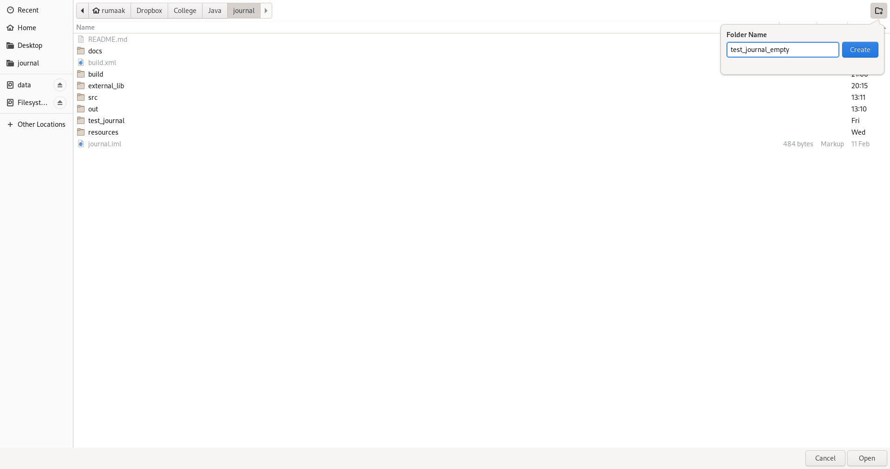

# Journal
Journal desktop application written in Java using JavaFX library.

### Goal
Write a JavaFX application for note taking, a journal. Concrete specification [here](https://github.com/rumaak/journal/wiki/Task-specification).

### Installation, run
- Clone this repository
- Download JavaFX 15 (eg. from [here](https://gluonhq.com/products/javafx/)) for your OS
- Unzip and copy `lib` folder into `external_lib`
    - in the Windows distribution, there is also folder `bin` - copy it too
- Run `ant run` in root directory of this repository
- (Optional) Run `ant doc` to generate `javadoc` documentation

### Usage
A short user guide describing how the application is supposed to be used.

##### General use
- Run `ant run`
- If running for the first time, a directory chooser window will pop up
    - select a directory inside which a journal will be stored (journals are compatible, an existing one can be selected if journal was already used there)
    - to change / remove journal directory location, see below
- On the left side of window a journal tree can be seen, on the right side an editor should show up
- Adding a new group / note
    - select a group under which you wish to add a new group / note
    - click on `add group` / `add note` button above tree view of journal (tooltips can help recognizing the buttons)
    - a new group / note with default name will be created in selected group
- Rename a group / note
    - select a group / note
    - click on `rename` button
    - edit name, press `enter`
- Delete a group / button
    - select a group / note
    - click the `delete` button
- Note editing
    - to start editing a note, select it in journal tree and click into editor
    - write, style a note as you wish
    - add an image if desired using `add image` button
    - when done editing, press ctrl+s or `save` button to save the note

##### Change / remove journal
- navigate to the directory where journal is stored
- delete everything inside the directory (or move it to new location)
- in the local repository clone, delete .config file

### Example
To ilustrate how the journal application is used, let us go over two simple usage examples.

##### Example of existing journal
In the root directory of this repository, there is an example journal already set up (test_journal), select it and click `open`.

A journal window should appear. Let's look into some already existing note - navigate to `Journal`|`subdir2`|`subsubdir` and select `note_nested_nested` (double click on group to expand it, click once on note to select it). Contents of the note can be seen in editor.

We may now modify the contents of this note. Let's add a new line saying "Maybe three." and let's make it bold. Save it by clicking on save button or by ctrl+s.

Now we can view another note somewhere in the journal (by selecting it). If we were to return to the note we edited, we could see that it still contains our newly added text. We might also close and open the journal application, and see that it is still there.

##### Example creating new journal
Running the application for the first time (or after deleting the `.config` file) will cause a directory chooser window to pop up. Let's create a new directory called `test_journal_empty` and open it via directory chooser.

This will cause a window with empty journal to appear.

Because empty journal isn't very entertaining, we shall add some groups to it. Let's add groups named `work` and `school` - that can be done by clicking on `add group` button twice and then renaming new items using `rename` button (all buttons are above journal tree). Then we are going to select the `school` group and add two notes (using an `add note` button), which we are going to name `Java` and `Cpp` respectively.

We could edit added notes, but we've already covered that. Instead, we realize that we've gotten older and we don't go to school anymore, so the time has come to delete the `school` group. To do that, simply select the `school` group and click on `delete` button above the journal tree.

All changes are saved, we can close the journal.
